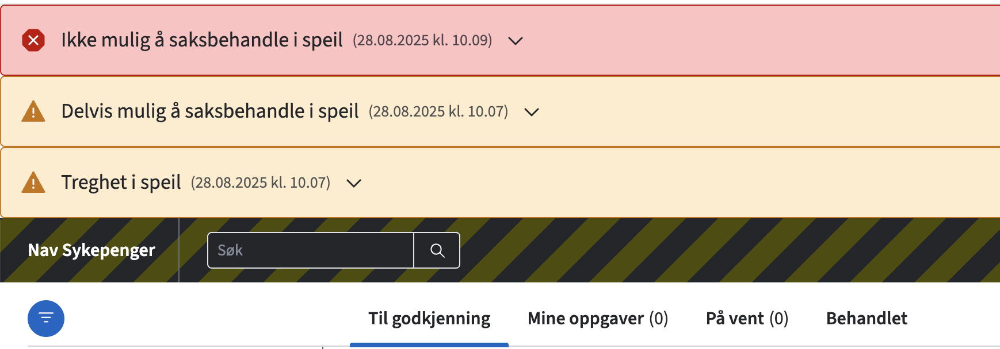
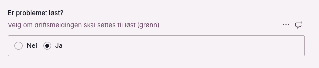
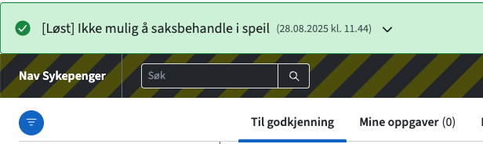

# Spalten

[🔗 Spalten i prod](https://spalten.sanity.studio/)

## Beskrivelse

Spalten er et støtteverktøy som gir mulighet til å redigere tekstfelt i saksbehandlerløsningen Speil ved hjelp av Sanity.

Sanity er et såkalt "hodeløst CMS" (Headless Content Management System) som gir utviklere og innholdsskapere en moderne måte å administrere innhold på. Ler mer om sanity på [Graphiq](https://www.graphiq.design/verktoy/web/v/sanity/r/recRHeHhrBoevsvmQ) eller [Sanity](https://www.sanity.io/)

_Hva brukes Spalten til nå?_

- Endring av maler for skjønnsmessig fastsettelse § 8-30, 2. ledd og 3. ledd
  - Årsak, begrunnelse og konklusjon
- Aktivering/deaktivering (toggle) av maler i produksjon
- Oversikt over varsler
- Aktivering/deaktivering (toggle) av driftsmeldinger i produksjon
- Endring av Annulleringsårsaker
- Endring av På vent-årsaker

## Kom i gang

### Tilgang

- Legg til sanity.io i [My Apps](http://myapplications.microsoft.com/).
- Åpne spalten, trykk på navnet ditt øverst i høyre hjørne -> `Manage project`.
- Logg inn med SSO -> organisasjon er navikt
- Velg `Members`.
- Be en developer eller admin om developer-tilgang så du kan deploye.

For å kunne foreta endringer i Spalten må du være medlem av AzureAD-gruppen tbd.

### Utvikle lokalt

1. Installer prosjektet - `pnpm install`
2. Kjør Speil lokalt med next dev server - `pnpm run dev`

## Hvordan lage driftsmelding

For hver driftsmelding skal det lages et nytt dokument i Spalten.
Dette finner du under kategorien "Driftsmeldinger".

Eksempel av en driftsmelding

Driftsmeldingene består av konsekvens, årsak, tiltak, oppdatering og hva saksbehandler eventuelt kan jobbes med.
Konsekvens er tittel og avgjør variant av driftsmelding (warning eller error) som er skissert under. Årsak skal beskrive hva feilen skyldes.
Tiltak skal beskrive hva som blir gjort for å rette feilen. Oppdatering skal brukes hvis saken varer lengre enn en time.
"Hva kan du gjøre?" skal beskrive hva saksbehandler eventuelt kan gjøre mens feilen pågår. Datoen fylles inn automatisk når dokumentet opprettes.

Når driftsmeldingen er ferdig utfylt skal dette dokumentet publiseres. Dette gjøres ved å trykke nederst til høyre på "Publish".
Blir dokumentet ikke publisert blir det ikke laget en driftmelding.

Oppdater driftsmeldingen når problemet er løst.

Driftsmeldingen blir oppdatert til grønn farge og får status "løst", denne blir stående i 30 minutter og blir borte automatisk.

## Henvendelser

Spørsmål knyttet til koden eller prosjektet kan stilles som issues her på GitHub.

Interne henvendelser kan sendes via Slack i kanalen [#team-bømlo-værsågod](https://nav-it.slack.com/archives/C019637N90X).
