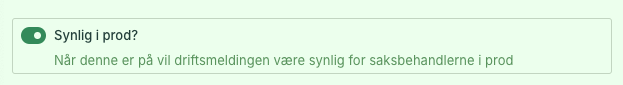
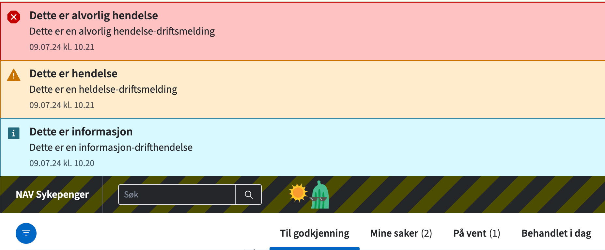

# Spalten

[🔗 Spalten i prod](https://spalten.intern.nav.no/)

## Beskrivelse

Spalten er et støtteverktøy som gir mulighet til å redigere tekstfelt i saksbehandlerløsningen Speil ved hjelp av Sanity.

Sanity er et såkalt "hodeløst CMS" (Headless Content Management System) som gir utviklere og innholdsskapere en moderne måte å administrere innhold på. Ler mer om sanity på [Graphiq](https://www.graphiq.design/verktoy/web/v/sanity/r/recRHeHhrBoevsvmQ) eller [Sanity](https://www.sanity.io/)

_Hva brukes Spalten til nå?_

- Endring av maler for skjønnsmessig fastsettelse § 8-30, 2. ledd og 3. ledd
  - Årsak, begrunnelse og konklusjon
- Aktivering/deaktivering (toggle) av maler i produksjon
- Oversikt over varsler
- Aktivering/deaktivering (toggle) av driftsmeldinger i produksjon
- Endring av Annulleringsårsaker

## Kom i gang

### Tilgang

- Legg til sanity.io i [My Apps](http://myapplications.microsoft.com/).
- Åpne spalten, trykk på navnet ditt øverst i høyre hjørne -> `Manage project`.
- Logg inn med SSO.
- Velg `Members`.
- Be en developer eller admin om developer-tilgang så du kan deploye.

For å kunne foreta endringer i Spalten må du være medlem av AzureAD-gruppen tbd.

### Utvikle lokalt

- npx yarn install
- npx yarn dev

### Deploy

Du må deploye endringer i sanity i tillegg til at dette committes til Github.

- npx yarn run sanity login --sso navikt
- npx yarn run sanity deploy

## Hvordan lage driftsmelding

For hver driftsmelding skal det lages et nytt dokument i Spalten.
Dette finner du under kategorien "Driftsmeldinger".

Driftsmeldingene består av tittel, melding og dato.
Tittel skal være konkret og kort, mens meldingen kan være en mer detaljert beskrivelse og når det eventuelt forventes at problemet skal være løst.
Datoen fylles inn automatisk når dokumentet opprettes.

"Synlig i prod?" feltet skal toggles på (grønn) for at driftsmeldingen skal være synlig i speil.

Driftsmeldingene består av nivåene "Info", "Hendelse" og "Alvorlig hendelse" som er skissert under. Velg riktig nivå for driftsmeldingen.

Når driftsmeldingen er ferdig utfylt skal dette dokumentet publiseres.
Dette gjøres ved å trykke nederst til høyre på "Publish".
Blir dokumentet ikke publisert blir det ikke laget en driftmelding.

For å fjerne driftsmeldingen i speil så skal toggelen for prod skrus av og for å fjerne driftsmeldingen fra dev-miljø skal "Fjerne fra utviklingsmiljø?" toggles på.
Dette må også publiseres for at driftsmeldingen skal fjernes.

## Henvendelser

Spørsmål knyttet til koden eller prosjektet kan stilles som issues her på GitHub.

Interne henvendelser kan sendes via Slack i kanalen [#team-bømlo-værsågod](https://nav-it.slack.com/archives/C019637N90X).
